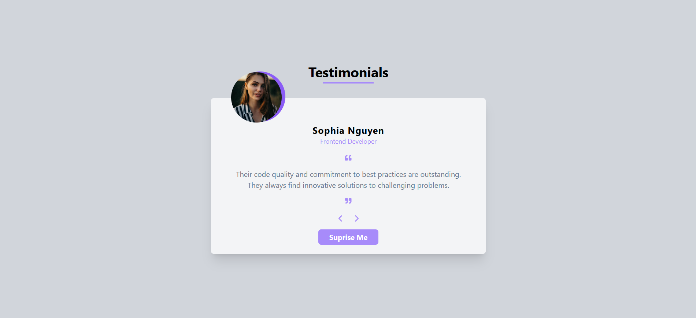

# Testimonials Carousel using React

## Overview
This project demonstrates how to create a testimonial slider component using React. A testimonial slider is a common UI element used to display customer or user reviews in a dynamic and engaging way.

## Screenshot



## Features
- Displays user testimonials in a slider format.
- Supports navigation through buttons.
- Mobile-responsive for easy use on various devices.
- Click "Surprise Me" for a random review.

## Tech Stack

- **React**: Front-end library for building UI.
- **Tailwind CSS**: For styling.
- **React Icons**: Icon library for navigation and quotes.

## Installation

1. **Clone the repository:**
   ```bash
   git clone https://github.com/Mithun-AM/Testimonials-Carousel-using-React.git

2. **Navigate to the project directory:**
   ```bash
   cd Testimonials-Carousel-using-React

3. **Install dependencies:**
   ```bash
   npm install

4. **Run the app:**
   ```bash
   npm start
